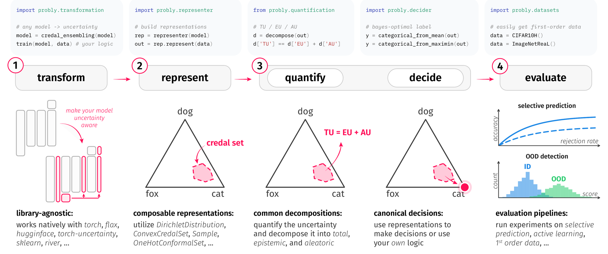
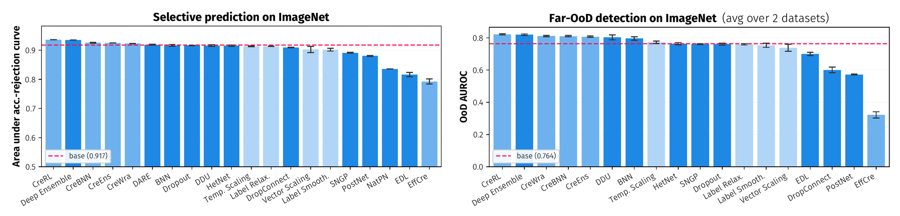
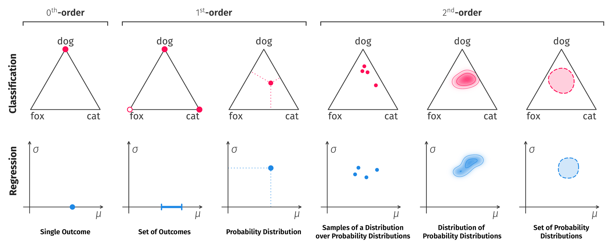
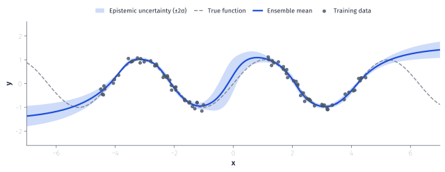

# probly: Uncertainty Representation and Quantification for Machine Learning
<div align="center">
<picture>
  <source srcset="docs/source/_static/logo/logo_dark.png" media="(prefers-color-scheme: dark)">
  <source srcset="docs/source/_static/logo/logo_light.png" media="(prefers-color-scheme: light)">
  
</picture>

[](https://badge.fury.io/py/probly)
[](https://pypi.org/project/probly)
[](https://pypi.org/project/probly)
[](https://pepy.tech/project/probly)
[](https://opensource.org/licenses/MIT)

[](https://github.com/pwhofman/probly/actions/workflows/ci.yml)
[](https://codecov.io/gh/pwhofman/probly)
[](https://pwhofman.github.io/probly)
[](.github/CONTRIBUTING.md)
[](https://github.com/pwhofman/probly/commits/main)
</div>

<div align="center">
<em>Turn any model into one that knows what it doesn't know.</em>
</div>

`probly` is a **library-agnostic** toolkit for **uncertainty representation and
quantification** in machine learning. Make any PyTorch, Flax/JAX, scikit-learn, River, or
Hugging Face model uncertainty-aware in a single line, then **represent**, **quantify**,
and **decompose** its predictive uncertainty into **aleatoric** and **epistemic** parts.
It ships 40+ methods — from Bayesian nets and deep ensembles to evidential, credal, and
conformal prediction — behind one consistent API.

<div align="center">
  <picture>
    <source srcset="docs/source/_static/readme/backends_dark.png" media="(prefers-color-scheme: dark)">
    <source srcset="docs/source/_static/readme/backends_light.png" media="(prefers-color-scheme: light)">
    
  </picture>
</div>

<div align="center">
  <picture>
    <source srcset="docs/source/_static/readme/from_paper/paper_workflow_dark.png" media="(prefers-color-scheme: dark)">
    <source srcset="docs/source/_static/readme/from_paper/paper_workflow_light.png" media="(prefers-color-scheme: light)">
    
  </picture>
  <br />
  <em>One composable four-stage workflow — <strong>transform</strong>, <strong>represent</strong>, <strong>quantify</strong>/<strong>decide</strong>, <strong>evaluate</strong>.</em>
</div>

## 🛠️ Install
`probly` is intended to work with **Python 3.13 and above**. Installation can be done via `pip`
or `uv`:

```sh
pip install probly
```

```sh
uv add probly
```

## ⭐ Quickstart

`probly` makes it very easy to make models uncertainty-aware and perform several downstream tasks:

```python
from probly.method import dropout
from probly.representer import representer
from probly.quantification import quantify
from probly.evaluation.ood import evaluate_ood

net = ...  # get neural network

# transform model: keep dropout active at inference (MC dropout)
model = dropout(net, p=0.25, predictor_type="logit_classifier")

train(model)  # train model as usual

# represent uncertainty: turn stochastic forward passes into a predictive distribution
rep = representer(model, num_samples=50)
out_id = rep.represent(data_id)
out_ood = rep.represent(data_ood)

# quantify epistemic (model) uncertainty
eu_id = quantify(out_id).epistemic.detach().numpy()
eu_ood = quantify(out_ood).epistemic.detach().numpy()

# evaluate: does uncertainty separate in-distribution from out-of-distribution?
print(evaluate_ood(eu_id, eu_ood))
```

Output:

```text
{'auroc': 0.94}
```

Swap `dropout` for `ensemble`, `bayesian`, `laplace`, or any other method below — the rest of the pipeline stays the same. That is what makes a systematic comparison cheap: the same pipeline, run across 20+ methods on ImageNet.

<div align="center">
  <picture>
    <source srcset="docs/source/_static/readme/from_paper/paper_benchmark_dark.png" media="(prefers-color-scheme: dark)">
    <source srcset="docs/source/_static/readme/from_paper/paper_benchmark_light.png" media="(prefers-color-scheme: light)">
    
  </picture>
  <br />
  <em>Selective prediction and out-of-distribution detection on ImageNet, mean over three runs.<br />See the <a href="https://pwhofman.github.io/probly">docs</a> for the full benchmark.</em>
</div>

## 🎲 Methods at a glance

Every method below is a **one-line transformation** that works the same for a linear model, a CNN, a GNN, or an LLM. Apply one ante-hoc or post-hoc — wrap an existing model to make it uncertainty-aware, or build an uncertainty-native one from scratch.

What differs between them is *how* they represent uncertainty — `probly` covers the whole spectrum, from a single outcome to a set of probability distributions:

<div align="center">
  <picture>
    <source srcset="docs/source/_static/readme/from_paper/paper_representations_dark.png" media="(prefers-color-scheme: dark)">
    <source srcset="docs/source/_static/readme/from_paper/paper_representations_light.png" media="(prefers-color-scheme: light)">
    
  </picture>
  <br />
  <em>From a point prediction to a set of probability distributions — every representation below is one of these.</em>
</div>

#### 🧠 Second-order distributions

Turn a point predictor into a *distribution over distributions* — by sampling, ensembling, distance to the training data, or an evidential head.

<details>
<summary><strong>Show all 21 methods</strong></summary>

| Method | Reference | Backends |
| :--- | :--- | :--- |
| MC dropout (`dropout`) | [Gal & Ghahramani, 2016](http://proceedings.mlr.press/v48/gal16.html) | torch · flax |
| MC dropconnect (`dropconnect`) | [Mobiny et al., 2021](https://doi.org/10.1038/s41598-021-84854-x) | torch · flax |
| Mean-field Bayesian networks (`bayesian`) | [Blundell et al., 2015](http://proceedings.mlr.press/v37/blundell15.html) | torch |
| Laplace approximation (`laplace`) | [Daxberger et al., 2021](https://arxiv.org/abs/2106.14806) | torch |
| Deep ensembles (`ensemble`) | [Lakshminarayanan et al., 2017](https://proceedings.neurips.cc/paper/2017/hash/9ef2ed4b7fd2c810847ffa5fa85bce38-Abstract.html) | torch · flax · sklearn · river |
| BatchEnsemble (`batchensemble`) | [Wen et al., 2020](https://openreview.net/forum?id=Sklf1yrYDr) | torch · flax |
| Sub-ensembles (`subensemble`) | [Valdenegro-Toro, 2019](https://arxiv.org/abs/1910.08168) | torch · flax |
| Deep anti-regularized ensembles (`dare`)¹ | [de Mathelin et al., 2023](https://doi.org/10.48550/arXiv.2304.04042) | torch |
| Deterministic uncertainty quantification (`duq`) | [van Amersfoort et al., 2020](http://proceedings.mlr.press/v119/van-amersfoort20a.html) | torch |
| Deep deterministic uncertainty (`ddu`) | [Mukhoti et al., 2023](https://doi.org/10.1109/CVPR52729.2023.02336) | torch |
| Mahalanobis distance (`mahalanobis`) | [Lee et al., 2018](https://proceedings.neurips.cc/paper/2018/hash/abdeb6f575ac5c6676b747bca8d09cc2-Abstract.html) | torch |
| Direct epistemic uncertainty prediction (`deup`) | [Lahlou et al., 2023](https://openreview.net/forum?id=eGLdVRvvfQ) | torch |
| Spectral-normalized GP heads (`sngp`) | [Liu et al., 2020](https://proceedings.neurips.cc/paper/2020/hash/543e83748234f7cbab21aa0ade66565f-Abstract.html) | torch |
| Evidential classification (`evidential_classification`) | [Sensoy et al., 2018](https://proceedings.neurips.cc/paper/2018/hash/a981f2b708044d6fb4a71a1463242520-Abstract.html) | torch |
| Posterior networks (`posterior_network`) | [Charpentier et al., 2020](https://proceedings.neurips.cc/paper/2020/hash/0eac690d7059a8de4b48e90f14510391-Abstract.html) | torch |
| Natural posterior networks (`natural_posterior_network`) | [Charpentier et al., 2022](https://openreview.net/forum?id=tV3N0DWMxCg) | torch |
| Graph posterior networks (`graph_posterior_network`, `cuq_graph_neural_network`, `lop_graph_posterior_network`) | [Stadler et al., 2021](https://arxiv.org/abs/2110.14012) | torch |
| Prior networks (`prior_network`) | [Malinin & Gales, 2018](https://proceedings.neurips.cc/paper/2018/hash/3ea2db50e62ceefceaf70a9d9a56a6f4-Abstract.html) | torch |
| Evidential regression (`evidential_regression`) | [Amini et al., 2020](https://proceedings.neurips.cc/paper/2020/hash/aab085461de182608ee9f607f3f7d18f-Abstract.html) | torch |
| Heteroscedastic networks (`het_net`) | [Collier et al., 2021](https://openaccess.thecvf.com/content/CVPR2021/html/Collier_Correlated_Input-Dependent_Label_Noise_in_Large-Scale_Image_Classification_CVPR_2021_paper.html) | torch |
| Dirichlet activations & NIG heads (`dirichlet_*`, `normal_inverse_gamma_head`) | [Malinin et al., 2020](https://arxiv.org/abs/2006.11590) | torch |

¹ Built on the `ensemble` transformation and usable wherever it is.

</details>

#### ☁️ Credal sets

Represent uncertainty as a *set* of plausible distributions instead of a single second-order one.

<details>
<summary><strong>Show all 12 methods</strong></summary>

| Method | Reference | Backends |
| :--- | :--- | :--- |
| Credal wrapper (`credal_wrapper`)¹ | [Wang et al., 2025](https://openreview.net/forum?id=cv2iMNWCsh) | torch |
| Credal ensembling (`credal_ensembling`)¹ | [Nguyen et al., 2025](https://doi.org/10.1007/s10994-024-06703-y) | torch |
| Credal Bayesian deep learning (`credal_bnn`)¹ | [Caprio et al., 2024](https://openreview.net/forum?id=4NHF9AC5ui) | torch |
| Credal nets (`credal_net`)¹ | [Sale et al., 2024](https://openreview.net/forum?id=VJjjNrUi8j) | torch |
| Relative-likelihood credal prediction (`credal_relative_likelihood`)¹ | [Löhr et al., 2025](https://doi.org/10.48550/arXiv.2505.22332) | torch |
| Class-bias ensembles (`class_bias_ensemble`)³ | [Löhr et al., 2025](https://doi.org/10.48550/arXiv.2505.22332) | torch |
| Efficient credal prediction (`efficient_credal_prediction`)² | [Hofman et al., 2026](https://doi.org/10.48550/arXiv.2603.08495) | torch |
| Conformal credal set — inner product (`conformal_inner_product`) | [Sale et al., 2024](https://openreview.net/forum?id=VJjjNrUi8j) | torch |
| Conformal credal set — Kullback-Leibler (`conformal_kullback_leibler`) | [Sale et al., 2024](https://openreview.net/forum?id=VJjjNrUi8j) | torch |
| Conformal credal set — total variation (`conformal_total_variation`) | [Sale et al., 2024](https://openreview.net/forum?id=VJjjNrUi8j) | torch |
| Conformal credal set — Wasserstein (`conformal_wasserstein_distance`) | [Sale et al., 2024](https://openreview.net/forum?id=VJjjNrUi8j) | torch |
| Conformal credal set — Dirichlet relative likelihood (`conformal_dirichlet_relative_likelihood`) | [Sale et al., 2024](https://openreview.net/forum?id=VJjjNrUi8j) | torch |

¹ Built on the `ensemble` transformation and usable wherever it is. ² Also has a pure NumPy implementation. ³ The ensembling that `credal_relative_likelihood` builds on.

</details>

#### 📏 Conformal prediction

Distribution-free prediction sets and intervals with finite-sample coverage guarantees — pick the nonconformity score that matches your task.

<details>
<summary><strong>Show all 8 methods</strong></summary>

| Method | Reference | Backends |
| :--- | :--- | :--- |
| LAC (`conformal_lac`) | [Sadinle et al., 2019](https://arxiv.org/abs/1609.00451) | torch · flax · sklearn |
| APS (`conformal_aps`) | [Romano et al., 2020](https://arxiv.org/abs/2006.02544) | torch · flax · sklearn |
| SAPS (`conformal_saps`) | [Huang et al., 2024](https://arxiv.org/abs/2310.06430) | torch · flax · sklearn |
| RAPS (`conformal_raps`) | [Angelopoulos et al., 2021](https://arxiv.org/abs/2009.14193) | torch · flax · sklearn |
| Absolute-error CP (`conformal_absolute_error`) | [Angelopoulos & Bates, 2021](https://arxiv.org/abs/2107.07511) | torch · flax · sklearn |
| CQR (`conformal_cqr`) | [Romano et al., 2019](https://arxiv.org/abs/1905.03222) | torch · flax · sklearn |
| CQR-r (`conformal_cqr_r`) | [Sesia & Candès, 2020](https://arxiv.org/abs/1909.05433) | torch · flax · sklearn |
| UACQR (`conformal_uacqr`) | [Rossellini et al., 2024](https://arxiv.org/abs/2306.08693) | torch · flax · sklearn |

</details>

#### 🌡️ Calibration

Post-hoc fixes for over-confident probabilities, fitted on a held-out split.

<details>
<summary><strong>Show all 4 methods</strong></summary>

| Method | Reference | Backends |
| :--- | :--- | :--- |
| Temperature scaling (`temperature_scaling`) | [Guo et al., 2017](http://proceedings.mlr.press/v70/guo17a.html) | torch · sklearn |
| Platt scaling (`platt_scaling`) | [Platt, 1999](https://www.semanticscholar.org/paper/Probabilistic-Outputs-for-Support-vector-Machines-Platt/42e5ed832d4310ce4378c44d05570439df28a393) | torch · sklearn |
| Vector scaling (`vector_scaling`) | [Guo et al., 2017](http://proceedings.mlr.press/v70/guo17a.html) | torch · sklearn |
| Isotonic regression (`isotonic_regression`) | [Zadrozny & Elkan, 2002](https://doi.org/10.1145/775047.775151) | torch · sklearn |

</details>

Calibration-aware training losses ship too — label smoothing, [label relaxation](https://doi.org/10.1609/aaai.v35i10.17041), and [focal loss](https://doi.org/10.1109/ICCV.2017.324) in `probly.train.calibration.torch`.

#### 📐 Uncertainty quantification

Every method above produces a **representation**; `quantify` turns it into a number and `decompose` splits that number into its **aleatoric** and **epistemic** parts wherever the theory allows. The measures you can pick from, by the representation they consume:

- **Distributions** — `entropy`, `mutual_information`, `conditional_entropy`, `sample_variance`, `vacuity`, `dempster_shafer_uncertainty`
- **Credal sets** — `upper_entropy`, `lower_entropy`, `generalized_hartley`, `min_expected_total_variation`
- **Conformal sets** — `conformal_set_size`
- **Embeddings and text** — `spectral_entropy`, semantic entropy
- **Scoring rules** — `BrierLoss`, `LogLoss`, `SphericalLoss`, `ZeroOneLoss`

🤖 **LLM uncertainty**, too: semantic entropy and spectral uncertainty for Hugging Face text generation models — [see below](#-uncertainty-for-llms).

Browse the full [API reference](https://pwhofman.github.io/probly/stable/api.html) and the [examples gallery](https://pwhofman.github.io/probly/stable/examples.html) for the complete picture.

## 🤖 Uncertainty for LLMs

Does your language model *know* when it doesn't know? `probly` brings uncertainty quantification to text generation: sample multiple answers, cluster them by meaning with an NLI model, and decompose the resulting **semantic entropy** ([Kuhn et al., 2023](https://arxiv.org/abs/2302.09664)) into its aleatoric and epistemic parts.

<div align="center">
  <picture>
    <source srcset="docs/source/_static/readme/llm_uncertainty_demo_dark.svg" media="(prefers-color-scheme: dark)">
    <source srcset="docs/source/_static/readme/llm_uncertainty_demo_light.svg" media="(prefers-color-scheme: light)">
    
  </picture>
</div>

```python
from probly.quantification import decompose
from probly.representation.distribution.torch_categorical import TorchCategoricalDistributionSample
from probly.representer.clarifier.huggingface import HFQuestionClarifier
from probly.representer.sampler.huggingface import HFTextGenerationSampler, load_model
from probly.representer.semantic_clustering.huggingface import HFGreedySemanticClusterer

model, tokenizer = load_model("google/gemma-4-E2B-it")
clarifier = HFQuestionClarifier(model, tokenizer, num_samples=2)  # rephrase each question
sampler = HFTextGenerationSampler(model, tokenizer, num_samples=10, temperature=0.7)
clusterer = HFGreedySemanticClusterer.from_model_name("microsoft/deberta-base-mnli")

questions = ["What is the capital of France?", "Who was the first person to walk on Mars?"]

answers = sampler(clarifier(questions))  # sample answers per clarified question
semantic = clusterer(answers)            # cluster answers by meaning (NLI)

# densify the semantic clusters and decompose the semantic entropy
dense = TorchCategoricalDistributionSample(tensor=semantic.tensor.to_dense(), sample_dim=semantic.sample_dim)
uq = decompose(dense)

for question, tu, au, eu in zip(questions, uq.total, uq.aleatoric, uq.epistemic):
    print(f"{question:<45} TU={tu:.3f}  AU={au:.3f}  EU={eu:.3f}")
```

The factual question collapses into a single semantic cluster — the model is certain. The trick question scatters across many clusters: high uncertainty, flagging a likely hallucination. See [`examples/llm/semantic_entropy.py`](examples/llm/semantic_entropy.py) for the full pipeline and [`examples/llm/spectral_uncertainty.py`](examples/llm/spectral_uncertainty.py) for an embedding-based alternative.

## 📈 Uncertainty for regression

Where has your regressor actually *seen* data, and where is it just guessing? Wrap any model in a **deep ensemble** ([Lakshminarayanan et al., 2017](https://proceedings.neurips.cc/paper/2017/hash/9ef2ed4b7fd2c810847ffa5fa85bce38-Abstract.html)) and `probly` turns the members' disagreement into a predictive band that stays tight near the training data and fans out wherever the model extrapolates.

<div align="center">
  <picture>
    <source srcset="docs/source/_static/readme/regression_uncertainty_dark.svg" media="(prefers-color-scheme: dark)">
    <source srcset="docs/source/_static/readme/regression_uncertainty_light.svg" media="(prefers-color-scheme: light)">
    
  </picture>
</div>

```python
import numpy as np
import torch
import torch.nn as nn
from probly.method import ensemble
from probly.representer import representer
from probly.quantification.decomposition.variance import SecondOrderVarianceDecomposition

# 1D data with a gap in the middle — the model never sees x near 0
X = np.concatenate([np.random.uniform(-4.5, -1, 40), np.random.uniform(1, 4.5, 40)])
X = torch.from_numpy(X).float().reshape(-1, 1)
y = torch.sin(1.5 * X) + 0.12 * torch.randn_like(X)

net = nn.Sequential(nn.Linear(1, 64), nn.Tanh(), nn.Linear(64, 64), nn.Tanh(), nn.Linear(64, 1))

# transform: build a deep ensemble, re-initialising each member for diversity
ens = ensemble(net, num_members=10, reset_params=True)

for member in ens:  # train each member as usual
    opt = torch.optim.Adam(member.parameters(), lr=0.01)
    for _ in range(400):
        opt.zero_grad()
        loss = nn.functional.mse_loss(member(X), y)
        loss.backward()
        opt.step()

# represent + quantify: mean prediction and its uncertainty over a wide grid
grid = torch.linspace(-7, 7, 400).reshape(-1, 1)
out = representer(ens).predict(grid)
unc = SecondOrderVarianceDecomposition(out)

mean = out.tensor.mean(dim=out.sample_axis)  # ensemble mean
std = unc.epistemic.sqrt()                   # wide where members disagree — i.e. away from data
# plot mean ± 2 * std to reproduce the band above
```

Tight bands where the model has seen data, wide bands in the gap and past the edges: the ensemble *knows where it is guessing*. `SecondOrderVarianceDecomposition` also exposes `.total` and `.aleatoric`, so you can separate model disagreement (epistemic) from irreducible noise (aleatoric) — see [`examples/quantification/plot_ensemble_regression.py`](examples/quantification/plot_ensemble_regression.py) for the full walkthrough.

## 📖 Documentation with tutorials

New to `probly`? Start with the [user guide](https://pwhofman.github.io/probly/stable/user_guide.html) and the [examples gallery](https://pwhofman.github.io/probly/stable/examples.html). The full [documentation](https://pwhofman.github.io/probly) covers the entire workflow, including the [API reference](https://pwhofman.github.io/probly/stable/api.html).

## 🤝 Contributing
Contributions are welcome - see [CONTRIBUTING.md](.github/CONTRIBUTING.md) for guidelines on adding methods, representations, or evaluation protocols.

## 📜 License
This project is licensed under the [MIT License](https://github.com/pwhofman/probly/blob/main/LICENSE).

---
Built with ❤️ by the probly team.
