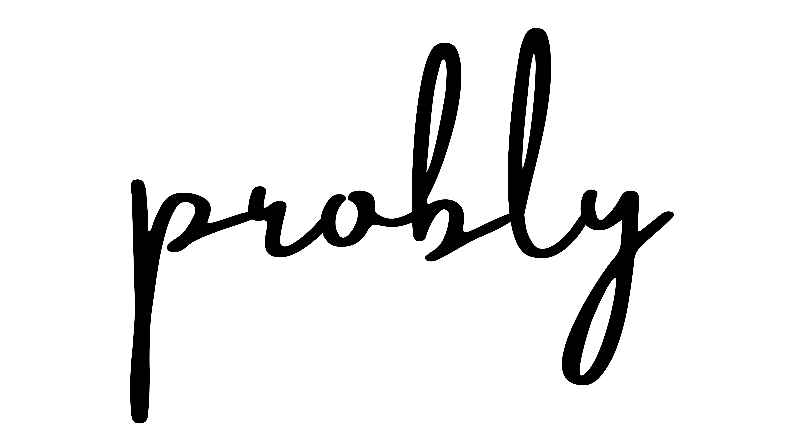

# probly: Uncertainty Representation and Quantification for Machine Learning
<div align="center">
<picture>
  <source srcset="docs/source/_static/logo/logo_dark.png" media="(prefers-color-scheme: dark)">
  <source srcset="docs/source/_static/logo/logo_light.png" media="(prefers-color-scheme: light)">
  
</picture>

[](https://drive.google.com/file/d/1gpQStxaR7VYS2GWcGmko8z-yMFSa2Gc6/view?usp=share_link)

[](https://badge.fury.io/py/probly)
[](https://pypi.org/project/probly)
[](https://pepy.tech/project/probly)
[](https://codecov.io/gh/pwhofman/probly)
[](.github/CONTRIBUTING.md)
[](https://opensource.org/licenses/MIT)
</div>

## Gemma 4 Demo

The `web/` directory on the [`gemma4`](https://github.com/pwhofman/probly/tree/gemma4) branch
contains a prototype that pairs `probly` with Gemma 4 to surface
uncertainty directly in a chat interface. Note for running it yourself: We are dealing with a real local Gemma Model on your machine with full access. You have to perfrom the following:

```sh
git checkout gemma4

# backend
cd web/backend
uv sync
uv run uvicorn app.main:app --reload --port 8000

# frontend (in a second terminal)
cd web/frontend
npm install
npm run dev
```

Then open http://localhost:5173.

## 🛠️ Install
`probly` is intended to work with **Python 3.12 and above**. Installation can be done via `pip` and
or `uv`:

```sh
pip install probly
```

```sh
uv add probly
```

## ⭐ Quickstart

`probly` makes it very easy to make models uncertainty-aware and perform several downstream tasks:

```python
import probly
import torch.nn.functional as F

net = ...  # get neural network
model = probly.method.dropout(net)  # make neural network a Dropout model
train(model)  # train model as usual

data = ...  # get data
data_ood = ...  # get out of distribution data
sampler = probly.representation.Sampler(model, num_samples=20)
sample = sampler.predict(data)  # predict an uncertainty representation
sample_ood = sampler.predict(data_ood)

eu = probly.quantification.classification.mutual_information(sample)  # quantify model's epistemic uncertainty
eu_ood = probly.quantification.classification.mutual_information(sample_ood)

auroc = probly.evaluation.tasks.out_of_distribution_detection(eu, eu_ood)  # evaluate model's uncertainty
```

## 📜 License
This project is licensed under the [MIT License](https://github.com/pwhofman/probly/blob/main/LICENSE).

---
Built with ❤️ by the probly team.
