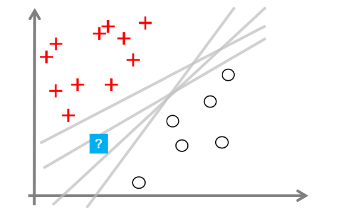
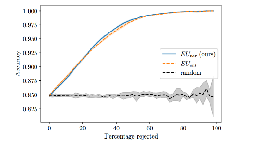

(core_concepts)=
#Core Concepts

Core Concepts
=============

1. Understanding Uncertainty in Machine Learning
-------------------------------------------------

This section explains what uncertainty means in machine learning, why it naturally
arises in real-world problems, and why handling it correctly is essential for
building trustworthy models. Probly provides tools to work with uncertainty in a
structured and unified way.

1.1 What Is Uncertainty?
^^^^^^^^^^^^^^^^^^^^^^^^

In standard machine learning pipelines a model outputs a **single prediction**
a class label, a probability, or a regression value. However this number does
not tell us **how confident** the model actually is.

In machine learning, uncertainty refers to the **degree of confidence** a model
has in its outputs. There are two fundamental types:

**Epistemic Uncertainty**

Uncertainty caused by lack of knowledge or insufficient training data.
The model may never have seen anything similar before, for example
a rare medical anomaly or an unusual object in autonomous driving.
This uncertainty can be reduced with more or better data.

**Aleatoric Uncertainty**

Uncertainty caused by noise in the data itself.
Labels may be ambiguous, sensors may be unreliable, or images may be blurry.
This uncertainty cannot be eliminated simply by collecting more data.

Most classical ML models such as neural networks or random forests
ignore both forms of uncertainty and return only a single output, often
leading to overconfident predictions.

.. figure:: Aleatorische.png
   :alt: Aleatoric uncertainty illustration
   :width: 35%
   :align: center

probly addresses this by offering unified tools to represent and quantify both
epistemic and aleatoric uncertainty across different methods.

1.2 Sources of Uncertainty
^^^^^^^^^^^^^^^^^^^^^^^^^^^^

Uncertainty appears naturally throughout the ML pipeline. Common sources include:

**Limited or Biased Training Data**

Small, imbalanced, or unrepresentative datasets cause poor generalization.
When the model encounters unfamiliar examples, predictions become unreliable.

**Out of Distribution Inputs**

Inputs that differ significantly from the training data, such as new environments,
novel objects, or corrupted images. Models often give confident but wrong
predictions for such samples.

**Label Noise and Ambiguity**

Human annotators may disagree or produce inconsistent labels.
Some domains, for example medicine or law, inherently contain subjective judgments.

**Model Architecture Limitations**

Certain architectures cannot express uncertainty well.
A deterministic network without any probabilistic layers, for example,
will always output a single best guess regardless of how unsure it is.

probly provides mechanisms to model all these uncertainty sources explicitly
instead of ignoring them.

1.3 Why Overconfidence Is a Problem?
^^^^^^^^^^^^^^^^^^^^^^^^^^^^^^^^^^^^^

Modern ML models are often overconfident. They produce strong high probability
predictions even when they should be unsure. This causes serious issues in
real world systems:

**Safety Critical Failures**

- A diagnostic model reporting 0.99 confidence despite being unsure.
- An autonomous vehicle misreading a rare obstacle but still reacting as if it were certain.

**Miscalibration**

The model’s predicted probabilities do not match reality.
For example predictions marked as 90 percent confident may be correct only 60 percent of the time.

**Poor Decision Making**

Downstream systems such as doctors, financial engines, or controllers
may rely on predictions that look certain but are actually unstable.

**Erosion of Trust**

Professionals and regulators increasingly require models not only to
provide predictions but also to communicate how reliable those
predictions are.

probly directly addresses these challenges by offering consistent tools to
express, compare, and act on model uncertainty, helping prevent dangerous
overconfidence.

2. Representing Uncertainty
---------------------------------------------

2.1 What Is an Uncertainty Representation?
^^^^^^^^^^^^^^^^^^^^^^^^^^^^^^^^^^^^^^^^^^^^^^^^

An uncertainty representation describes the form in which a machine-learning model expresses not only its prediction but also its confidence in that prediction. Instead of returning a single label such as “cat,” an uncertainty-aware model produces additional information that reflects how sure or unsure it is about its output.

Such representations can take many forms, including probability distributions, repeated stochastic samples, raw logits, or evidence values for higher-level distributions. In practice, they may appear as sets of sampled outputs, vectors of class probabilities, parameters of a distribution, or structured intervals. All of these formats serve the same purpose: they quantify how uncertain the model is about its own prediction.

2.2 Common Representation Types
^^^^^^^^^^^^^^^^^^^^^^^^^^^^^^^^^^^^

**Dropout-based representations**

Dropout-based representations arise when a model is evaluated multiple times with stochastic dropout activated. Each pass yields a slightly different output, and the collection of these outputs represents the model’s uncertainty.

**Ensemble-based representations**

Ensemble-based representations rely on several independently trained models whose predictions are combined; the variability across models expresses the epistemic uncertainty.

**Evidential representations**

Evidential representations work by predicting the parameters of a higher-order distribution rather than explicit samples. This allows the model to express both a belief and uncertainty about that belief through a single forward pass.

**Bayesian sampling representations**

Bayesian sampling representations describe uncertainty by drawing samples from distributions placed over the model’s weights, leading to sampled predictions that approximate the full predictive distribution.

**Predictive distribution representations**

Predictive distribution representations output parameters of a probability distribution or predictive intervals directly, allowing uncertainty to be expressed in a compact parametric form.

2.3 Why Representations Must Be Unified
^^^^^^^^^^^^^^^^^^^^^^^^^^^^^^^^^^^^^^^^

Different uncertainty methods produce outputs that vary widely in dimensionality, structure, and meaning. Some provide many samples, others return explicit distribution parameters, and others supply intervals or evidence values. Without a unifying framework, these heterogeneous outputs cannot be compared or processed consistently.

Differences in shape, scale, interpretability, and semantics would make quantitative evaluation and benchmarking extremely difficult. A unified representation ensures that uncertainty estimates from different methods become compatible and can be analyzed within the same workflow.

2.4 How probly Standardizes Representations
^^^^^^^^^^^^^^^^^^^^^^^^^^^^^^^^^^^^^^^^^^^^^^

Probly standardizes uncertainty by wrapping all forms of outputs into a single, unified representation object. This object provides a consistent interface for accessing samples, distribution parameters, evidence, or interval information, regardless of the underlying method that produced them.

Through this standardization, all uncertainty-quantification procedures, such as entropy calculations, variance-based metrics, scoring rules, or distance measures can operate on the same structure.

As a result, different uncertainty methods integrate seamlessly into one workflow, enabling fair comparison, reproducibility, and coherent processing across an entire pipeline.

3. Quantifying and Using Uncertainty
---------------------------------------------

3.1 What is Uncertainty Quantification?
^^^^^^^^^^^^^^^^^^^^^^^^^^^^^^^^^^^^^^^^
Models after being made uncertainty-aware can generate various forms of uncertainty representations (e.g., samples, credal sets, distributions over distributions).
Uncertainty quantification means converting these pipe representations into numerical measures of uncertainty.

Typical measures:

**Entropy-based measures**
– Total entropy
– Decompositions (e.g., upper/lower entropy)

**Variance-based measures**
– Variance of model predictions, e.g., B. in ensembles or MC dropout

**Scoring-Rule-Based Quantification**
– Uncertainty measures via "Proper Scoring Rules"

**Wasserstein-Based Quantification**
– Distance between probability distributions as an indicator of uncertainty

At the same time, these measures are connected  with the two types of uncertainty:

Aleatory uncertainty – inherent randomness of the data

Epistemic uncertainty – the model's lack of knowledge (e.g., insufficient or poor-quality training data)

Thus:

Quantification = generating one or more meaningful numbers per example from an uncertainty representation.

3.2 Why Quantification is Important
^^^^^^^^^^^^^^^^^^^^^^^^^^^^^^^^^^^^^^
What is the purpose of uncertainty quantification?

It is the foundation for making models comparable, testable, and usable.

Why this is important:

**Comparing model behavior**
Different uncertainty-aware models (MC Dropout, Bayesian NN, Ensembles, Evidential, Conformal Prediction, etc.) can only be meaningfully compared if their uncertainties are made measurable.

**Detecting invalid predictions**
Quantified uncertainty allows the detection of cases where the model "doesn't know that it doesn't know"—for example, in the OOD (Out-of-Distribution Detection) examples in the presentation.

**Better decisions**
The Tasks section visually demonstrates how uncertainty is used to make more risk- or security-conscious decisions (e.g., Accuracy-Rejection Curves).

Without quantification, there is no basis for these decisions.

3.3 Downstream Tasks
^^^^^^^^^^^^^^^^^^^^^^^^
Following the quantification section, the presentation presents various practical tasks:

**Out-of-Distribution (OOD) Detection**
Models should detect whether an input does not originate from the training distribution.
For excample: OOD detection as one of the central downstream modules in "Tasks & Visualization"

**Selective Prediction / Confidence-Based Rejection**
The model is allowed to say "I don't know."
Represented in the form of the accuracy-rejection curves:

   Accuracy–Rejection Curve illustrating how model accuracy improves as uncertain samples are rejected.

**Calibration**
Goal: Prediction probabilities should correspond to the actual frequency.

**Risk-Aware Decision Making**
The visualization shows how quantification is used to make risk-adjusted decisions.
For excample corresponding grid plots and derivations from credal sets and entropies:
[Platzhalter]

.. raw:: html

   <table style="width:100%; border:0px;">
     <tr>
       <td style="width:40%; vertical-align:top; padding-right:20px;">
         
       </td>
       <td style="vertical-align:top;">
         

         The figure shows three complementary ways to represent uncertainty within the probability simplex:  
         <b>top:</b> a credal set capturing all admissible distributions, 
         <b>middle:</b> discrete samples describing a distribution over distributions, 
         <b>bottom:</b> a continuous density reflecting epistemic uncertainty through entropy.  
         Such representations are essential for risk-aware decision making, as they allow decisions
         to be adjusted based on distributional ambiguity, entropy-based decompositions,
         or worst-case reasoning.
         

       </td>
     </tr>
   </table>

3.4 How everything is connected
^^^^^^^^^^^^^^^^^^^^^^^^^^^^^^^^^^^^

**1. Model Transformation**
First, an existing machine learning model is transformed into an uncertainty-aware model using a PyTraverse rule (e.g., MC Dropout, Bayesian Layers).

**2. Uncertainty Representation**
The model outputs specific structures:
Samples, credal sets, interval predictions, distributions of distributions

**3. Uncertainty Quantification**
From these representations, entropies, variances, scores, etc., are calculated (several methods are available).

**4. Downstream Tasks & Visualization**
OOD detection, accuracy-rejection curves, uncertainty visualization, etc., build directly upon this.
