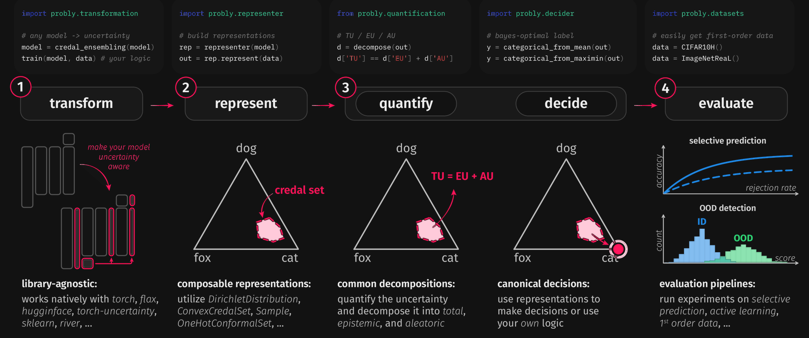

.. _core_pillars:

======================
Core Pillars of Probly
======================

The previous part described uncertainty without mentioning a single function.
This part does the opposite: it takes the same four questions and shows where
each of them lives in the library.

The mapping is deliberately one-to-one.

.. list-table::
    :header-rows: 1
    :widths: 30 30 40

    * - Question
      - Pillar
      - Entry point
    * - How does a model *carry* uncertainty at all?
      - :ref:`Transformation <pillar-transformation>`
      - ``probly.transformation`` / ``probly.method``
    * - What shape does a prediction have?
      - :ref:`Representation <pillar-representation>`
      - ``probly.representer``, ``probly.representation``
    * - How much uncertainty is that, and of which kind?
      - :ref:`Quantification <pillar-quantification>`
      - ``probly.quantification``
    * - Was any of this useful?
      - :ref:`Evaluation <pillar-evaluation>`
      - ``probly.evaluation``, ``probly.metrics``

.. image:: ../_static/readme/from_paper/paper_workflow_light.png
    :class: only-light
    :alt: The four-stage probly workflow: transform a model to make it
        uncertainty-aware, represent its predictive uncertainty, quantify and
        decompose it into total, epistemic and aleatoric parts, and evaluate
        the result in a downstream task.
    :width: 100%

        uncertainty-aware, represent its predictive uncertainty, quantify and
        decompose it into total, epistemic and aleatoric parts, and evaluate
        the result in a downstream task.
    :width: 100%

The pillars are separate on purpose. Every uncertainty library has to make the
same four decisions; most of them fuse the decisions into a single object, so
that switching the method also silently switches the measure, and a number
computed under one method cannot be compared with a number computed under
another. In ``probly`` each stage is one import, each stage is swappable
independently, and the interface between two stages is a
:ref:`representation <uq-representing>`, never a framework-specific object.

.. _pillars-one-pipeline:

One Pipeline, Four Stages
=========================

Everything below is an elaboration of this snippet.

.. code-block:: python

    from probly.method import dropout
    from probly.representer import representer
    from probly.quantification import quantify
    from probly.evaluation.ood import evaluate_ood

    net = ...  # any trained torch or flax network

    # 1. transform: keep dropout active at inference (MC dropout)
    model = dropout(net, p=0.25, predictor_type="logit_classifier")

    # 2. represent: turn stochastic forward passes into a second-order representation
    rep = representer(model, num_samples=50)
    out_id = rep.represent(data_id)
    out_ood = rep.represent(data_ood)

    # 3. quantify: reduce the representation to total/aleatoric/epistemic scalars
    eu_id = quantify(out_id).epistemic
    eu_ood = quantify(out_ood).epistemic

    # 4. evaluate: does the epistemic part separate in- from out-of-distribution?
    print(evaluate_ood(eu_id, eu_ood))

Every line but the first is fixed. Replacing ``dropout`` with ``ensemble``,
``laplace``, or ``sngp`` changes stage 1 only, because all of them hand back the
same kind of representation to stage 2. That is the whole design in one
sentence.

.. _pillar-transformation:

Pillar 1: Transformation
========================

A transformation takes a model that predicts a point and returns a model that
predicts something richer. It is the only stage that touches your network.

Transformations come in two flavours, and the distinction decides how much work
adopting one costs you:

*Post-hoc* transformations wrap an already-trained model. ``dropout`` re-enables
existing dropout layers, ``laplace`` fits a curvature approximation around the
trained weights, ``calibration`` rescales the logits on a held-out split.
Nothing is retrained.

*Ante-hoc* transformations change the architecture or the loss, so training has
to happen afterwards. ``ensemble`` gives you *N* models to fit, ``bayesian``
replaces deterministic layers with mean-field ones, ``posterior_network``
attaches a normalizing-flow head.

.. code-block:: python

    from probly.method import dropout, ensemble

    mc = dropout(net, p=0.25, predictor_type="logit_classifier")  # post-hoc
    ens = ensemble(net, num_members=10, reset_params=True)        # ante-hoc, train after

Two things make this work across backends. The transformation walks the layer
tree with ``pytraverse`` and dispatches *per layer type*, so it never needs to
know what the model as a whole is; and the backends are registered lazily, so
importing ``probly`` does not import ``torch``, ``flax``, or ``sklearn``.
:ref:`methods` catalogues what ships today and which backends each one supports.

.. note::

    ``probly.method`` is the catalogue namespace users import from;
    ``probly.transformation`` holds the implementations. They export the same
    callables.

.. _pillar-representation:

Pillar 2: Representation
========================

A representation is the object that crosses the boundary between stages. It is
what :ref:`uq-representing` describes in the abstract, made into a type:
``CategoricalDistribution``, ``Sample``, ``ConvexCredalSet``,
``ProbabilityIntervalsCredalSet``, and so on, each with an array, torch, and
JAX implementation.

The *representer* is the adapter that builds one:

.. code-block:: python

    from probly.representer import representer

    rep = representer(mc, num_samples=50)
    out = rep.represent(x)   # or rep(x), or rep.predict(x)

For a sampling method the representer runs the forward pass 50 times and stacks
the results into a ``Sample`` of categorical distributions. For an ensemble it
runs each member once. For a method that already emits a Dirichlet, the
representer is the identity. The caller does not need to know which of those
happened.

This is where the library earns the separation. A representation knows its own
semantics --- which axis is the sample axis, whether it lives on the simplex,
whether it is a set or a distribution --- and stage 3 dispatches on exactly
that. It does not know or care that stage 1 was MC dropout.

.. seealso::

    :ref:`uq-representing` for the order ladder that the types mirror, and
    ``probly.decider`` for reducing a representation to a decision --- for
    example collapsing a second-order distribution to a first-order one with
    ``categorical_from_mean``, or to the maximin-optimal one for a credal set.

.. _pillar-quantification:

Pillar 3: Quantification
========================

Quantification maps a representation to a number. There are two levels of
entry point, and the difference between them matters:

.. code-block:: python

    from probly.quantification import decompose, entropy, measure

    h = entropy(out)        # a named measure, applied directly
    m = measure(out)        # the canonical notion for this representation
    uq = decompose(out)     # -> .total, .aleatoric, .epistemic

The named measures --- ``entropy``, ``mutual_information``, ``vacuity``,
``sample_variance``, ``spectral_entropy``, and the rest --- are ordinary
functions you call when you know exactly which number you want. ``measure`` and
``decompose`` are the dispatching layer: they pick the decomposition registered
for *this* representation and return, respectively, its canonical notion
(usually the total) and the full split.

*Which* split is admissible depends on the representation. The entropy
decomposition of a second-order distribution is not the same object as the
upper/lower entropy of a credal set, and neither is defined for a bare
first-order distribution --- there is nothing there to split. The library
encodes that in the dispatch rather than in a docstring warning: asking for a
decomposition that does not exist for your representation raises
``NotImplementedError`` instead of returning a quietly meaningless number.

The notions ``TotalUncertainty``, ``AleatoricUncertainty``, and
``EpistemicUncertainty`` are first-class, so a downstream stage can ask for
"the epistemic part" without knowing which decomposition produced it. That is
what lets the active-learning strategies in stage 4 be written once.

:ref:`uq-quantifying` covers the measures themselves and where decomposition is
undefined.

.. _pillar-evaluation:

Pillar 4: Evaluation
====================

A quantifier always returns a number, including when the number is meaningless.
The last pillar is what stops that from going unnoticed. ``probly.evaluation``
ships the three downstream tasks that uncertainty is usually justified by:

:Out-of-distribution detection: ``evaluate_ood`` --- does the uncertainty score
    separate in-distribution from out-of-distribution inputs? Reported as AUROC.
:Selective prediction: abstain on the most uncertain fraction and measure what
    accuracy remains. A useful uncertainty makes the risk-coverage curve fall.
:Active learning: use uncertainty to choose the next labels, and compare the
    resulting learning curve against random acquisition.

.. code-block:: python

    from probly.evaluation.ood import evaluate_ood

    print(evaluate_ood(eu_id, eu_ood))   # {'auroc': 0.94}

Alongside these, ``probly.metrics`` holds the intrinsic scores --- calibration
error, proper scoring rules, coverage --- which ask a different question:
whether the predicted distribution is *right*, rather than whether the derived
score is *useful*. :ref:`uq-evaluating` draws that distinction properly.

.. _pillars-composition:

Why the Stages Compose
======================

Three dispatch mechanisms hold the pillars apart:

- **Type dispatch** (``flexdispatch``) routes ``predict``, ``representer``, and
  ``quantify`` to the right backend based on the object handed in.
- **Traverser dispatch** (``flexdispatch_traverser``) walks a network layer by
  layer, so a transformation is defined per layer type instead of per model.
- **Value dispatch** (``switchdispatch``) maps names to implementations, which
  is what makes the string arguments in the snippets above work.

The practical consequence is the benchmark: one pipeline, 20+ methods, changed
one line at a time. If you are adding a method, the pillar structure is also the
checklist --- a new method needs a transformation, must declare which
representation it produces, and inherits stages 3 and 4 for free.

.. seealso::

    :ref:`methods` walks the catalogue, grouped by the representation each
    method produces.
