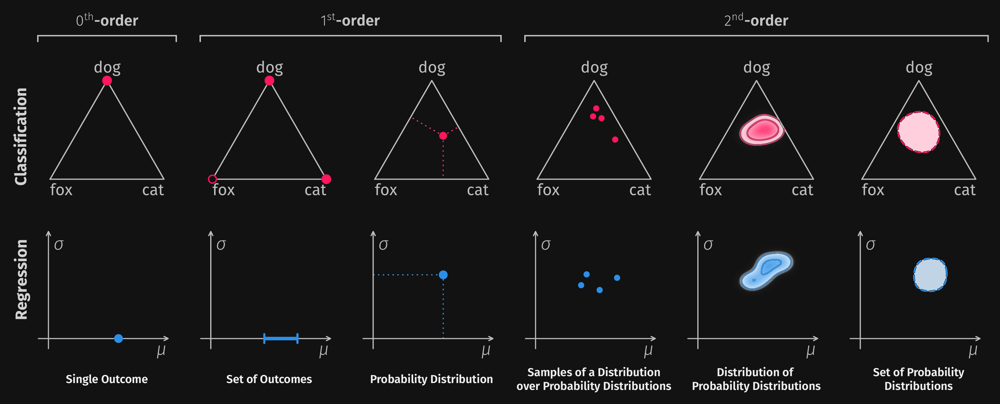

.. _uq-representing:

=========================
Representing Uncertainty
=========================

- the two cases from :ref:`uq-why` did not need more numbers, they needed a different kind of object
- a **representation** is what a prediction *is*: the shape of the thing the model hands back
- the shapes form a ladder by *order*: an outcome, a distribution over outcomes, a distribution over distributions
- each rung can state something the rung below has no slot for, and costs more to produce, to reduce to a number, and to check
- thesis for this part: **choosing a method is choosing a representation**, which is why the catalogue in :ref:`methods` is grouped by representation and not by algorithm
- everything downstream is fixed by this choice: which measures apply :ref:`uq-quantifying`, whether a split exists :ref:`decomposing the total <uq-decomposition>`, what evaluation can even ask :ref:`uq-evaluating`

.. image:: ../../_static/readme/from_paper/paper_representations_light.png
    :class: only-light
    :alt: The ladder of representations for classification and regression: a
        single outcome, a set of outcomes, a probability distribution, samples
        of a distribution over distributions, a distribution over
        distributions, and a set of distributions.
    :width: 100%

        single outcome, a set of outcomes, a probability distribution, samples
        of a distribution over distributions, a distribution over
        distributions, and a set of distributions.
    :width: 100%

.. _uq-zeroth-order:

Zeroth Order: Point Predictions
-------------------------------

- the bottom rung: one outcome, "dog", or one number for regression
- no runner-up and no scale, which is what ``argmax`` did to the 0.51 in the first place
- the softmax score is not the missing scale: it is a normalized logit, trained by a loss that rewards ranking the right class first, not constrained to be a frequency
- modern networks are systematically overconfident, so the score is high far more often than it is right :cite:`guoOnCalibration2017`
- fixing the scale is :ref:`calibration <methods-calibration>`, and it is a fix *within* first order, not a way up the ladder
- what it buys: cheapest to produce, one unambiguous decision, comparable across models
- what it costs: no way to abstain, and no slot at all for "no basis for an answer"

.. _uq-first-order:

First Order: Probability Distributions
--------------------------------------

- one distribution over the outcomes: (0.51, 0.49, 0.00), or a mean and a variance for regression
- carries the odds, which outcomes compete and by how much, so it can express ambiguity of the world
- this is the object most of machine learning already outputs, and the one proper scoring rules and calibration are defined on :ref:`uq-evaluating`
- it represents :ref:`aleatoric uncertainty <uq-aleatoric>` well: the entropy of this distribution is the standard total-uncertainty number
- what it cannot do is the point of :ref:`uq-why`: a distribution has no slot for a claim about itself, so both readings of (0.34, 0.33, 0.33) are literally the same object here
- consequence for the next part: total uncertainty is all it can report, decomposition on it is undefined :ref:`uq-decomposition`
- and the number it does report is *total*, not aleatoric: calling it aleatoric imports the assumption that the model is correct
- some methods land here by construction and target one part only: a heteroscedastic head models label noise, so it yields an aleatoric quantity and no epistemic one :cite:`kendallWhatUncertainties2017, collierCorrelatedInputDependent2021`

.. _uq-second-order:

Second Order: Distributions Over Distributions
-----------------------------------------------

- the rung that fits case b: mass spread over the simplex itself, a distribution over where the first-order distribution might be
- read it as the answer to "how much would my predictive distribution move if I had trained differently?"
- ten distributions clustered tightly means the odds are pinned down, ten scattered across the simplex means the model does not know the odds
- this is the geometry that makes the split computable: spread *between* the distributions is epistemic, average spread *within* them is aleatoric :ref:`uq-decomposition`
- two encodings, and the difference is where you pay:
- **sampled**, a finite set of first-order distributions you have to draw, ensemble members, dropout passes, posterior weight samples :cite:`lakshminarayananSimpleScalable2017` :cite:`galDropoutBayesian2016`, resolution is yours to buy with the sample count, and you buy it again at every prediction
- **parameterized**, the second-order distribution in closed form from a single forward pass, typically a Dirichlet over the simplex :cite:`sensoyEvidentialDeep2018` :cite:`malininPredictiveUncertaintyEstimation2018`, cheap at inference, expensive at training because the architecture or the loss changes
- a sampled set is an approximation of the object, not the object: measures computed on it are estimates and carry sample-size bias :ref:`uq-measures`
- the split it supports is only as trustworthy as the collection it is computed over: members trained the same way on the same data agree for reasons that have nothing to do with the input :cite:`fortDeepEnsembles2019`
- and the collection is a property of the setup, not of the world: :ref:`distribution shift <uq-sources>` moves both parts at once, so numbers from two setups are not comparable even on the same inputs :cite:`snoekCanYouTrust2019`
- the honest caveat: second-order probabilities are a claim of a new kind, they are not directly checkable against observed frequencies, and which measure to read off one is still contested :cite:`saleSecondOrder2024`
- the family catalogue: :ref:`methods-second-order`

.. _uq-sets:

Sets of Outcomes
~~~~~~~~~~~~~~~~

- the same refusal to commit, applied one level down: not "which distribution", but "which outcomes stay in play"
- return a *set* of labels, {dog, cat}, or an interval for regression
- the size of the set is the uncertainty, and no probability is attached to the members
- this is what conformal prediction returns, with a finite-sample coverage guarantee under exchangeability of calibration and test data :cite:`angelopoulosGentleIntroduction2021`
- the guarantee is what makes the rung attractive: it holds whatever the underlying model does
- but coverage is **marginal**, averaged over the distribution, not conditional on this input
- a set is closer to a decision than to a description: it says which outcomes are in play, not which of them is more plausible
- it is also *derived* rather than produced: a score from a lower rung plus a calibration split, so it is a re-encoding and not a step up the ladder
- silent about the split, a wide set does not say whether the world or the model made it wide :ref:`methods-conformal`

.. _uq-credal:

Credal Sets
-----------

- refuse to pick one distribution, and refuse to weight the candidates too: a *set* of admissible distributions with no distribution over it
- motivation: a second-order distribution asks you to commit to precise probabilities over precise probabilities, which is more precision than the evidence usually supports
- this is imprecise probability, so every query is answered by a **lower** and an **upper** probability, an interval instead of a number :cite:`wangCredalWrapper2024`
- two encodings: the convex hull of vertices, one vertex per ensemble member, and per-class probability intervals, coarser but far cheaper to reason with
- the *width* of the set is the epistemic part: a single point is complete knowledge of the odds, the whole simplex is none
- measures come in upper/lower pairs, and the split is a different object from the second-order one :cite:`abellanDisaggregatedTotal2006` :cite:`abellanNonSpecificity2000`
- a set does not order the actions, so deciding needs an extra rule, maximin or interval dominance or a betting probability :cite:`cuzzolinIntersectionProbability2022`
- the family catalogue: :ref:`methods-credal`

.. _uq-choosing-representation:

Choosing a Representation
-------------------------

.. list-table::
    :header-rows: 1
    :widths: 24 40 36

    * - Representation
      - What it buys
      - What it costs
    * - :ref:`Point prediction <uq-zeroth-order>`
      - a decision, and nothing to misread
      - no uncertainty of any kind, no abstention
    * - :ref:`Set of outcomes <uq-sets>`
      - which outcomes are in play, with a coverage guarantee
      - a calibration split, marginal coverage only, no odds inside the set
    * - :ref:`Probability distribution <uq-first-order>`
      - the odds, total uncertainty, calibration and scoring rules
      - no claim about itself, so no split
    * - :ref:`Second order <uq-second-order>`
      - the aleatoric/epistemic split
      - many passes or a changed loss, and a precision that is hard to check
    * - :ref:`Credal set <uq-credal>`
      - bounds instead of a number, no forced weighting
      - vertices or bounds to produce, and a decision rule to add

- what the rows look like as objects, on the same three-class problem, "cat" against "dog" against "fox"

Point Prediction
~~~~~~~~~~~~~~~~

- the object is an index: "dog"
- two inputs with predictions (0.49, 0.51, 0.00) and (0.33, 0.34, 0.33) reduce to the *same* point prediction
- nothing in the object says one of them was a near-tie and the other a three-way tie

.. image:: /auto_examples/representation/images/sphx_glr_plot_first_order_distribution_001.png
    :alt: Two bar charts, one per input, each with a single full-height bar on
        the class "dog" and nothing on the other two classes.
    :width: 100%

Probability Distribution
~~~~~~~~~~~~~~~~~~~~~~~~

- the object is a vector on the simplex: (0.49, 0.51, 0.00)
- the two inputs are now different objects, one rules "fox" out and the other keeps all three in play
- for regression the same rung is a mean and a variance, two predictions can share a mean and differ only in spread
- in the library: a categorical distribution, or a Gaussian for the real-valued case

.. image:: /auto_examples/representation/images/sphx_glr_plot_first_order_distribution_002.png
    :alt: Two bar charts, one per input, one showing probabilities 0.49 and
        0.51 with the third class at zero, the other showing three near-equal
        bars.
    :width: 100%

.. image:: /auto_examples/representation/images/sphx_glr_plot_first_order_distribution_003.png
    :alt: Two Gaussian densities with the same mean, one narrow and one wide.
    :width: 100%

- the example: :ref:`sphx_glr_auto_examples_representation_plot_first_order_distribution.py`

Second Order, Sampled
~~~~~~~~~~~~~~~~~~~~~

- the object is a collection: ten vectors, one per ensemble member or dropout pass
- two inputs can have the *same* mean prediction and still differ, one has its members on top of each other, the other has them scattered across the simplex
- that spread is the claim about itself the first-order rung had no slot for
- the count is part of the object: ten members give a coarser picture than a hundred, and measures read off them move with it

.. image:: /auto_examples/representation/images/sphx_glr_plot_second_order_sample_001.png
    :alt: Two simplex triangles, the left one with ten member points on top of
        each other, the right one with the same mean prediction but ten points
        scattered widely.
    :width: 100%

- the example: :ref:`sphx_glr_auto_examples_representation_plot_second_order_sample.py`

Second Order, Parameterized
~~~~~~~~~~~~~~~~~~~~~~~~~~~

- the object is a density on the simplex, a Dirichlet given by its concentration parameters
- normalized, they are the mean prediction, summed, they are how much evidence the model claims
- (18, 14, 8) and (0.9, 0.7, 0.4) have the same mean prediction and nothing else in common
- one forward pass produces it, so there is no sample count to buy, and no sample-size bias to report

.. image:: /auto_examples/representation/images/sphx_glr_plot_dirichlet_distribution_001.png
    :alt: Two simplex triangles showing Dirichlet densities, the left one a
        concentrated blob in the interior, the right one with the mass pushed
        out to the edges and corners.
    :width: 100%

- the example: :ref:`sphx_glr_auto_examples_representation_plot_dirichlet_distribution.py`

Set of Outcomes
~~~~~~~~~~~~~~~

- the object is a subset of the labels, {dog}, {cat, dog}, or all three, and an interval for regression
- the members carry no odds: inside the set an outcome is simply in play
- the number to read off it is its size, which is the price paid for the coverage level the calibration step fixed

.. image:: /auto_examples/representation/images/sphx_glr_plot_conformal_prediction_set_001.png
    :alt: Three bar charts of class scores, with the labels kept in the
        prediction set colored and the dropped labels in gray, for set sizes
        one, two and three.
    :width: 100%

- the example: :ref:`sphx_glr_auto_examples_representation_plot_conformal_prediction_set.py`

Credal Set
~~~~~~~~~~

- the object is a region of the simplex, given by vertices or by per-class intervals
- no density inside it, so every query comes back as a lower and an upper probability
- the region's extent is the epistemic reading, a point is complete knowledge of the odds and the whole triangle is none
- two members predicting 0.1 and 0.9 and two members both predicting 0.5 share a mean and give very different regions

.. image:: /auto_examples/representation/images/sphx_glr_plot_convex_credal_set_001.png
    :alt: A simplex triangle with two filled polygons, one per input, each the
        convex hull of three vertex distributions.
    :width: 100%

- the examples: :ref:`sphx_glr_auto_examples_representation_plot_convex_credal_set.py` for the vertex encoding, :ref:`sphx_glr_auto_examples_representation_plot_probability_intervals_credal_set.py` for the interval one

Rules of Thumb
~~~~~~~~~~~~~~

- only a decision is needed, stay at zeroth; a guarantee is needed, take sets; the odds are the product, first order plus calibration; the response depends on *which* uncertainty, second order; committing to one distribution is the thing you object to, credal
- higher is not better: a rung you cannot estimate reliably is worse than a lower one you can, and the estimate is what :ref:`uq-evaluating` interrogates
- the choice is a constraint on the method, not just on the output, which is the grouping in :ref:`methods`
- in the library it is also the stage boundary: the representation is the only object that crosses from transformation to quantification :ref:`pillar-representation`
