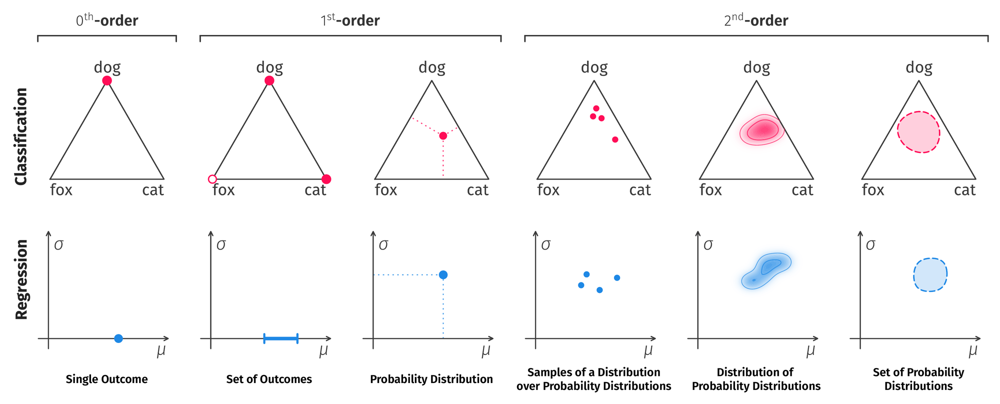
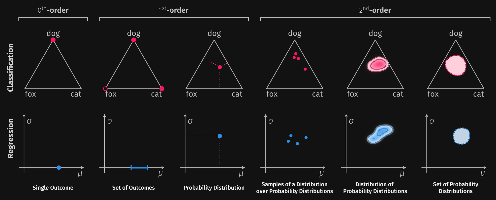

.. _uq-representing:

=========================
Representing Uncertainty
=========================

- the two cases from :ref:`uq-why` did not call for more numbers, but for a different kind of object
- a **representation** is what a prediction *is*, that is, the kind of object the model hands back
- roughly speaking, representations differ along two axes: *what* the prediction is uncertain about, and *whether* it weights the candidates
- the first axis is the *order*: a zeroth-order prediction expresses no uncertainty, a first-order one is uncertain about the outcome, and a second-order one about the first-order distribution itself
- along the second axis, a weighted representation spreads probability over the candidates, whereas an unweighted one only states which candidates remain admissible
- each order beyond the zeroth therefore comes in two forms: a distribution over outcomes or a set of outcomes, and a distribution over distributions or a set of distributions, the latter being known as a credal set
- a higher order can state something the lower ones have no slot for, but is correspondingly more expensive to produce, to reduce to a number, and to check
- whether weights help, on the other hand, depends on the evidence: they permit finer statements, at the price of a precision the data may not support
- since methods differ precisely in which of these objects they return, **choosing a method amounts to choosing a representation**, which is why :ref:`methods` groups the catalogue by representation rather than by algorithm
- this choice fixes everything downstream: which measures apply (:ref:`uq-quantifying`), whether a split exists (:ref:`decomposing the total <uq-decomposition>`), and what evaluation can ask at all (:ref:`uq-evaluating`)

        single outcome, a set of outcomes, a probability distribution, samples
        of a distribution over distributions, a distribution over
        distributions, and a set of distributions.
    :width: 100%

        single outcome, a set of outcomes, a probability distribution, samples
        of a distribution over distributions, a distribution over
        distributions, and a set of distributions.
    :width: 100%

.. _uq-zeroth-order:

Zeroth Order: Point Predictions
-------------------------------

- the bottom rung is a single outcome, "dog", or a single number in regression
- it has neither a runner-up nor a scale, which is exactly what ``argmax`` did to the 0.51 in the first place
- one may be tempted to take the softmax score as the missing scale, yet it is a normalized logit, trained by a loss that rewards ranking the correct class first, and nothing constrains it to be a frequency
- indeed, modern networks tend to be overconfident, so the score is high far more often than the prediction is right :cite:`guoOnCalibration2017`
- fixing the scale is the task of :ref:`calibration <methods-calibration>`, which is a fix *within* first order rather than a way up the ladder
- in return, this rung is the cheapest to produce, yields one unambiguous decision, and is comparable across models
- the price is that there is no way to abstain, and no slot at all for "no basis for an answer"

.. image:: /auto_examples/representation/images/sphx_glr_plot_first_order_distribution_001.png
    :alt: Two bar charts, one per input, each with a single full-height bar on
        the class "dog" and nothing on the other two classes.
    :width: 100%

- the example: :ref:`sphx_glr_auto_examples_representation_plot_first_order_distribution.py`

.. _uq-first-order:

First Order: Probability Distributions
--------------------------------------

- a single distribution over the outcomes, such as (0.51, 0.49, 0.00), or a mean and a variance in regression
- it carries the odds, that is, which outcomes compete and by how much, and can thus express the ambiguity of the world
- this is the object most of machine learning already outputs, and the one on which proper scoring rules and calibration are defined (:ref:`uq-evaluating`)
- its entropy is the standard measure of total uncertainty
- note that this number is *total*, not aleatoric: reading it as aleatoric presupposes that the model is correct, that is, that there is no epistemic part to separate
- what a distribution cannot do is the point of :ref:`uq-why`: it has no slot for a claim about itself, so both readings of (0.34, 0.33, 0.33) are literally the same object on this rung
- consequently, first order can report total uncertainty only, and a decomposition is undefined on it (:ref:`uq-decomposition`)
- some methods land on this rung by construction and target one part only: a heteroscedastic head models label noise, so it yields a quantity intended as aleatoric and none for the epistemic part :cite:`kendallWhatUncertainties2017, collierCorrelatedInputDependent2021`

.. image:: /auto_examples/representation/images/sphx_glr_plot_first_order_distribution_002.png
    :alt: Two bar charts, one per input, one showing probabilities 0.49 and
        0.51 with the third class at zero, the other showing three near-equal
        bars.
    :width: 100%

.. image:: /auto_examples/representation/images/sphx_glr_plot_first_order_distribution_003.png
    :alt: Two Gaussian densities with the same mean, one narrow and one wide.
    :width: 100%

- the example: :ref:`sphx_glr_auto_examples_representation_plot_first_order_distribution.py`

.. _uq-sets:

Sets of Outcomes
----------------

- a set of outcomes is uncertain about the same thing as a first-order distribution, namely the outcome, but it declines to weight the candidates and only states which of them remain in play
- the result is a *set* of labels, such as {dog, cat}, or an interval in regression
- since no probability is attached to its members, the size of the set is the uncertainty
- this is what conformal prediction returns, together with a finite-sample coverage guarantee under exchangeability of calibration and test data :cite:`angelopoulosGentleIntroduction2021`
- the guarantee is what makes the representation attractive, since it holds whatever the underlying model does
- the coverage it guarantees is, however, **marginal**, that is, averaged over the distribution rather than conditional on the input at hand
- a set is closer to a decision than to a description: it says which outcomes are in play, not which of them is more plausible
- it is typically derived rather than produced: a conformal procedure combines a score from a first-order model with a calibration split, so the set re-encodes that model's output at the same order, trading the weights for a guarantee
- it is silent about the split, since a wide set does not reveal whether the world or the model made it wide
- the methods for this representation are catalogued in :ref:`methods-conformal`

.. image:: /auto_examples/representation/images/sphx_glr_plot_conformal_prediction_set_001.png
    :alt: Three bar charts of class scores, with the labels kept in the
        prediction set colored and the dropped labels in gray, for set sizes
        one, two and three.
    :width: 100%

- the example: :ref:`sphx_glr_auto_examples_representation_plot_conformal_prediction_set.py`

.. _uq-second-order:

Second Order: Distributions Over Distributions
-----------------------------------------------

- this is the rung that fits case b: the mass is spread over the simplex itself, as a distribution over where the first-order distribution might lie
- roughly speaking, it answers the question of how much the predictive distribution would move had the model been trained differently
- ten distributions clustered tightly mean that the odds are pinned down, ten scattered across the simplex mean that the model does not know the odds
- this geometry is what makes the split computable: the spread *between* the distributions is epistemic, the average spread *within* them is aleatoric (:ref:`uq-decomposition`)
- two encodings are in use, and they differ mainly in where the cost is paid
- **sampled**: a finite collection of first-order distributions that has to be drawn, from ensemble members, dropout passes, or posterior weight samples :cite:`lakshminarayananSimpleScalable2017` :cite:`galDropoutBayesian2016`; the resolution is bought with the sample count, and bought again at every prediction
- **parameterized**: the second-order distribution in closed form from a single forward pass, typically a Dirichlet over the simplex :cite:`sensoyEvidentialDeep2018` :cite:`malininPredictiveUncertaintyEstimation2018`; cheap at inference, but expensive at training, since the architecture or the loss has to change
- a sampled collection approximates the object rather than being it, so measures computed on it are estimates and carry sample-size bias (:ref:`uq-measures`)
- the split is only as trustworthy as the collection behind it: members trained the same way on the same data may agree for reasons that have nothing to do with the input :cite:`fortDeepEnsembles2019`
- the collection is also a property of the setup rather than of the world, and :ref:`distribution shift <uq-sources>` moves both parts at once, so numbers from two setups are not comparable, even on the same inputs :cite:`snoekCanYouTrust2019`
- the remaining caveat is conceptual: second-order probabilities are a claim of a new kind, they cannot be checked directly against observed frequencies, and which measure to read off them is still contested :cite:`saleSecondOrder2024`
- the methods on this rung are catalogued in :ref:`methods-second-order`

.. image:: /auto_examples/representation/images/sphx_glr_plot_second_order_sample_001.png
    :alt: Two simplex triangles, the left one with ten member points on top of
        each other, the right one with the same mean prediction but ten points
        scattered widely.
    :width: 100%

- the example: :ref:`sphx_glr_auto_examples_representation_plot_second_order_sample.py`

.. image:: /auto_examples/representation/images/sphx_glr_plot_dirichlet_distribution_001.png
    :alt: Two simplex triangles showing Dirichlet densities, the left one a
        concentrated blob in the interior, the right one with the mass pushed
        out to the edges and corners.
    :width: 100%

- the example: :ref:`sphx_glr_auto_examples_representation_plot_dirichlet_distribution.py`

.. _uq-credal:

Credal Sets
-----------

- a credal set makes the move of a set of outcomes one order up: it is uncertain about the same thing as a second-order distribution, namely the first-order distribution, but it declines to weight the candidates
- that is, it is a *set* of admissible distributions with no distribution over it
- the motivation is that a second-order distribution demands precise probabilities over precise probabilities, which is often more precision than the evidence supports
- this is the setting of imprecise probability, in which every query is answered by a **lower** and an **upper** probability, that is, an interval instead of a number :cite:`wangCredalWrapper2024`
- two encodings are common: the convex hull of a set of vertices, one per ensemble member, and per-class probability intervals, which are coarser but far cheaper to reason with
- the *width* of the set is the epistemic part: a single point amounts to complete knowledge of the odds, the whole simplex to none
- measures accordingly come in lower/upper pairs, and the resulting split is a different object from the second-order one :cite:`abellanDisaggregatedTotal2006` :cite:`abellanNonSpecificity2000`
- since a set does not order the actions, a decision requires an additional rule, such as maximin, interval dominance, or a betting probability :cite:`cuzzolinIntersectionProbability2022`
- the methods for this representation are catalogued in :ref:`methods-credal`

.. image:: /auto_examples/representation/images/sphx_glr_plot_convex_credal_set_001.png
    :alt: A simplex triangle with two filled polygons, one per input, each the
        convex hull of three vertex distributions.
    :width: 100%

- the examples: :ref:`sphx_glr_auto_examples_representation_plot_convex_credal_set.py` for the vertex encoding, :ref:`sphx_glr_auto_examples_representation_plot_probability_intervals_credal_set.py` for the interval one

.. _uq-choosing-representation:

Choosing a Representation
-------------------------

.. list-table::
    :header-rows: 1
    :widths: 24 40 36

    * - Representation
      - What it buys
      - What it costs
    * - :ref:`Point prediction <uq-zeroth-order>`
      - a decision, and nothing to misread
      - no uncertainty of any kind, no abstention
    * - :ref:`Probability distribution <uq-first-order>`
      - the odds, total uncertainty, calibration and scoring rules
      - no claim about itself, hence no split
    * - :ref:`Set of outcomes <uq-sets>`
      - which outcomes are in play, with a coverage guarantee
      - a calibration split, marginal coverage only, no odds inside the set
    * - :ref:`Second order <uq-second-order>`
      - the aleatoric/epistemic split
      - many passes or a changed loss, and a precision that is hard to check
    * - :ref:`Credal set <uq-credal>`
      - bounds instead of a number, no forced weighting
      - vertices or bounds to produce, and a decision rule to add

- if only a decision is needed, stay at zeroth order
- if the odds are the product, take first order, together with calibration
- if a guarantee is needed, take a set of outcomes
- if the response depends on *which* uncertainty is present, take second order
- if committing to a single distribution is itself the objection, take a credal set
- neither a higher order nor weights are better per se: a representation that cannot be estimated reliably is worse than a simpler one that can, and the reliability of the estimate is precisely what :ref:`uq-evaluating` examines
- the choice constrains the method, not only its output, which is why :ref:`methods` is grouped this way
- in the library, it also marks a stage boundary: the representation is the only object that passes from transformation to quantification (:ref:`pillar-representation`)
