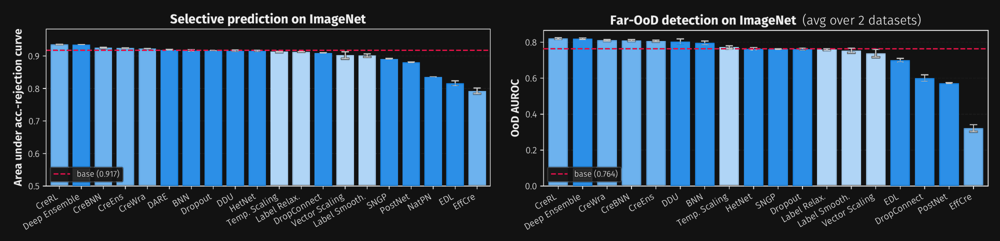

.. _nn-init-doc:
.. _locally-disable-grad-doc:
.. _index:

``probly``
==========

.. raw:: html
   :file: _includes/ecosystem_ring.html

.. rst-class:: probly-tagline

   Turn any model into one that knows what it doesn't know.

``probly`` is a **library-agnostic** toolkit for **uncertainty representation and quantification**
in machine learning. Make any PyTorch, Flax/JAX, scikit-learn, River, or Hugging Face model
uncertainty-aware in a single line, then **represent**, **quantify**, and **decompose** its
predictive uncertainty into **aleatoric** and **epistemic** components. It ships 40+ methods,
from Bayesian nets and deep ensembles to evidential, credal, and conformal prediction, all behind
the same unified API.

.. container:: probly-hero-buttons

   .. button-ref:: getting_started
      :ref-type: doc
      :color: primary
      :shadow:

      Get started

   .. button-ref:: auto_examples/index
      :ref-type: doc
      :color: primary
      :outline:

      Browse examples

   .. button-ref:: api
      :ref-type: doc
      :color: primary
      :outline:

      API reference

Uncertainty in a few lines
--------------------------

Transform a model, represent its predictions, quantify the uncertainty, and evaluate it on a
downstream task:

.. code-block:: python

   from probly.method import dropout
   from probly.representer import representer
   from probly.quantification import quantify
   from probly.evaluation.ood import evaluate_ood

   # transform: keep dropout active at inference (MC dropout)
   model = dropout(net, p=0.25, predictor_type="logit_classifier")
   train(model)  # train as usual

   # represent: turn stochastic forward passes into a predictive distribution
   rep = representer(model, num_samples=50)
   out_id, out_ood = rep.represent(data_id), rep.represent(data_ood)

   # quantify epistemic (model) uncertainty
   eu_id = quantify(out_id).epistemic.detach().numpy()
   eu_ood = quantify(out_ood).epistemic.detach().numpy()

   # evaluate: does uncertainty separate in-distribution from out-of-distribution?
   print(evaluate_ood(eu_id, eu_ood))  # {'auroc': 0.94}

Swap ``dropout`` for ``ensemble``, ``laplace``, ``sngp``, or any other method and the rest of the
pipeline stays the same:

.. grid:: 2 2 4 4
   :gutter: 2
   :class-container: probly-method-strip

   .. grid-item-card:: MC dropout
      :link: auto_examples/transformation/plot_dropout
      :link-type: doc
      :img-bottom: auto_examples/transformation/images/sphx_glr_plot_dropout_001.png
      :text-align: center

   .. grid-item-card:: Deep ensemble
      :link: auto_examples/transformation/plot_ensemble
      :link-type: doc
      :img-bottom: auto_examples/transformation/images/sphx_glr_plot_ensemble_001.png
      :text-align: center

   .. grid-item-card:: DUQ
      :link: auto_examples/method/plot_duq
      :link-type: doc
      :img-bottom: auto_examples/method/images/sphx_glr_plot_duq_001.png
      :text-align: center

   .. grid-item-card:: SNGP
      :link: auto_examples/method/plot_sngp
      :link-type: doc
      :img-bottom: auto_examples/method/images/sphx_glr_plot_sngp_001.png
      :text-align: center

See it in action
----------------

.. grid:: 1
   :gutter: 3

   .. grid-item-card:: Catch LLM hallucinations with semantic entropy
      :link: https://github.com/pwhofman/probly/blob/main/examples/llm/semantic_entropy.py

      Sample several answers, cluster them by meaning, and decompose the resulting semantic
      entropy. A model that says the same thing five ways is confident; one that says five
      different things is likely hallucinating.

      .. image:: _static/readme/llm_uncertainty_demo_light.svg
         :class: only-light
         :alt: Animated demo: a factual question collapses to one meaning with zero uncertainty,
               while a trick question scatters into seven meanings with high uncertainty

      .. image:: _static/readme/llm_uncertainty_demo_dark.svg
         :class: only-dark
         :alt: Animated demo: a factual question collapses to one meaning with zero uncertainty,
               while a trick question scatters into seven meanings with high uncertainty

.. grid:: 1 1 2 2
   :gutter: 3

   .. grid-item-card:: Regression: a band that widens off the data
      :link: auto_examples/quantification/plot_ensemble_regression
      :link-type: doc

      A deep ensemble turns member disagreement into an epistemic band: tight near the
      training data, wide in the gap and beyond.

      .. image:: _static/readme/regression_uncertainty_light.svg
         :class: only-light
         :alt: Deep-ensemble regression band, tight over the data and wide in the gap

      .. image:: _static/readme/regression_uncertainty_dark.svg
         :class: only-dark
         :alt: Deep-ensemble regression band, tight over the data and wide in the gap

   .. grid-item-card:: Out-of-distribution detection at ImageNet scale
      :link: guide/uncertainty/evaluating
      :link-type: doc

      A credal Bayesian network scores in-distribution ImageNet near zero and
      out-of-distribution iNaturalist much higher.

      .. image:: _static/readme/from_paper/paper_ood_histogram_light.png
         :class: only-light
         :alt: Histogram of uncertainty scores for in-distribution ImageNet and OoD iNaturalist

      .. image:: _static/readme/from_paper/paper_ood_histogram_dark.png
         :class: only-dark
         :alt: Histogram of uncertainty scores for in-distribution ImageNet and OoD iNaturalist

.. grid:: 1 2 3 3
   :gutter: 3

   .. grid-item-card:: Credal sets
      :link: auto_examples/representation/plot_convex_credal_set
      :link-type: doc
      :img-top: auto_examples/representation/images/sphx_glr_plot_convex_credal_set_001.png

      Represent ignorance as a set of distributions on the simplex.

   .. grid-item-card:: Conformal prediction
      :link: auto_examples/conformal/plot_regression_sklearn
      :link-type: doc
      :img-top: auto_examples/conformal/images/sphx_glr_plot_regression_sklearn_001.png

      Intervals with finite-sample coverage guarantees for any regressor.

   .. grid-item-card:: Streaming data
      :link: auto_examples/streaming/plot_arf_classification_stream
      :link-type: doc
      :img-top: auto_examples/streaming/images/sphx_glr_plot_arf_classification_stream_001.png

      Track aleatoric and epistemic uncertainty online and spot concept drift.

   .. grid-item-card:: Hugging Face vision
      :link: auto_examples/integrations/plot_transformers_depth_uncertainty
      :link-type: doc
      :img-top: auto_examples/integrations/images/sphx_glr_plot_transformers_depth_uncertainty_001.png

      Per-pixel uncertainty for a pretrained depth-estimation transformer.

   .. grid-item-card:: Second-order distributions
      :link: auto_examples/representation/plot_dirichlet_distribution
      :link-type: doc
      :img-top: auto_examples/representation/images/sphx_glr_plot_dirichlet_distribution_001.png

      A Dirichlet over the simplex: concentrated with evidence, flat without.

   .. grid-item-card:: Active learning
      :link: auto_examples/active_learning/plot_active_learning_sklearn
      :link-type: doc
      :img-top: auto_examples/active_learning/images/sphx_glr_plot_active_learning_sklearn_001.png

      Query the samples the model is most uncertain about and learn faster.

One pipeline, 20+ methods
-------------------------

Because every method shares the same interface, comparing them is a matter of changing one line.
Out-of-distribution detection on ImageNet with a ResNet50, far-OoD on the left and near-OoD on the
right, mean over three runs:

.. image:: _static/readme/from_paper/paper_benchmark_light.png
   :class: only-light
   :alt: Bar charts of OoD detection AUROC for 20+ uncertainty methods on ImageNet

Philosophy
----------

.. grid:: 1 1 3 3
   :gutter: 3

   .. grid-item-card:: Library-agnostic

      Works with the framework you already use: `PyTorch <https://pytorch.org>`_,
      `Flax <https://flax.readthedocs.io/en/latest/>`_ / `JAX <https://jax.readthedocs.io/en/latest/>`_,
      `scikit-learn <https://scikit-learn.org/stable/>`_, `River <https://riverml.xyz/latest/>`_,
      `Hugging Face <https://huggingface.co/docs/transformers/index>`_, and more.

   .. grid-item-card:: Model-agnostic

      From linear models to CNNs, graph networks, and transformer-based LLMs: ``probly`` fits into
      the models and pipelines you already have.

   .. grid-item-card:: Ante-hoc and post-hoc

      Bring your own model and let ``probly`` transform it, or build uncertainty-native models
      from the start with the built-in layers and methods.

.. toctree::
   :maxdepth: 1
   :caption: Table of Contents
   :hidden:

   getting_started
   installation
   user_guide
   examples
   api
   contributing/index
   references
   faq
